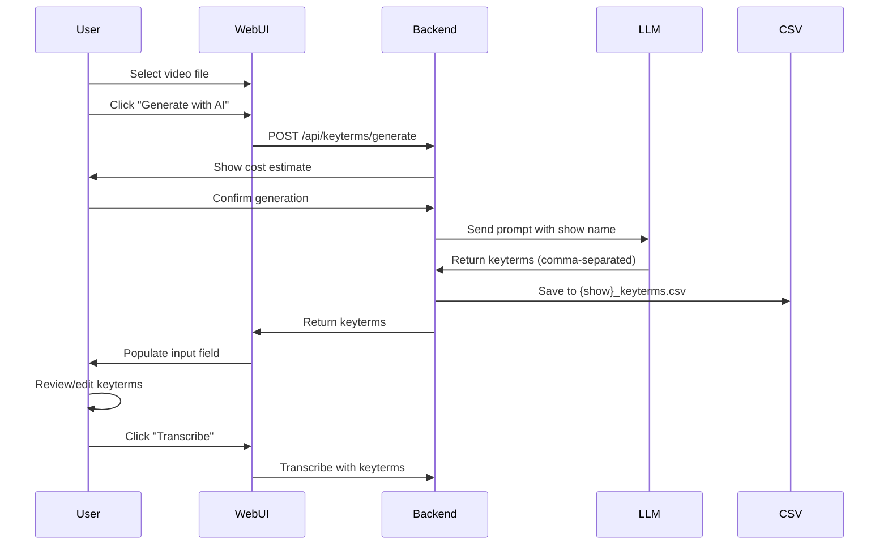
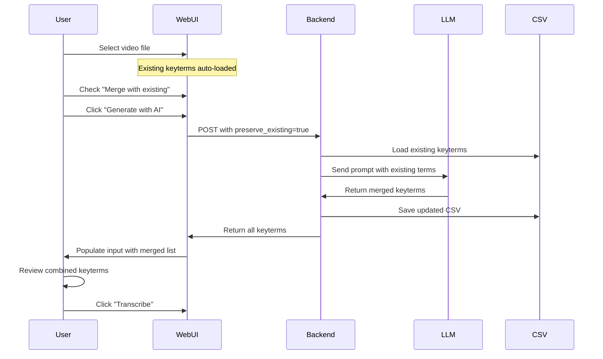
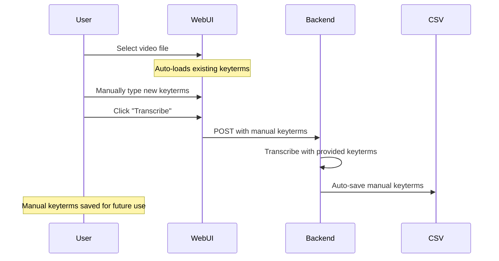

# LLM-Powered Keyterms Implementation Plan

**Version:** 1.0  
**Date:** 2025-10-25  
**Status:** 🚧 In Development  
**Author:** Tyler B. Crawford

---

## Executive Summary

This document outlines the complete implementation plan for adding LLM-powered keyterm generation to the Deepgram Subtitles project. The feature allows users to automatically generate high-quality keyterms using AI (Anthropic Claude or OpenAI GPT) by analyzing show/movie metadata, improving transcription accuracy up to 90%.

**⚠️ CRITICAL PREREQUISITE:** Before implementing LLM features, the existing keyterms UI bug must be fixed (Phase 0). The keyterms field currently doesn't clear when navigating between videos or refreshing the page, which can cause wrong keyterms to be applied to different shows.

**Architecture Decision:** Separate, optional module (`core/keyterm_search.py`) - NOT integrated into main transcription flow.

---

## Table of Contents

1. [Overview & Goals](#overview--goals)
2. [Architecture & Design Principles](#architecture--design-principles)
3. [Technical Specifications](#technical-specifications)
4. [Implementation Checklist](#implementation-checklist)
5. [User Workflow](#user-workflow)
6. [Testing Strategy](#testing-strategy)
7. [Cost & Performance Considerations](#cost--performance-considerations)
8. [Future Enhancements](#future-enhancements)

---

## Overview & Goals

### Primary Goals

1. **Enable LLM-powered keyterm generation** using Anthropic Claude or OpenAI GPT models
2. **Maintain separation from core transcription** - keep transcription fast and LLM usage optional
3. **Support both new and existing keyterms** - preserve, merge, or overwrite existing terms
4. **Provide cost transparency** - show estimated LLM API costs before generation
5. **Seamless integration** - minimal UI changes, maximum usability

### Success Criteria

- ✅ Generate accurate, contextually relevant keyterms for any show/movie
- ✅ Allow users to review/edit before using
- ✅ Support multiple LLM providers (Anthropic, OpenAI)
- ✅ Maintain existing manual keyterm workflow
- ✅ Complete in <30 seconds for typical request
- ✅ Clear cost estimation before generation

---

## Architecture & Design Principles

### Separation of Concerns

```
┌─────────────────────────────────────────────────────────────┐
│                  CORE TRANSCRIPTION FLOW                     │
│                     (Fast Path - No LLM)                     │
│                                                              │
│  core/transcribe.py → CSV keyterms → Deepgram API          │
└─────────────────────────────────────────────────────────────┘

┌─────────────────────────────────────────────────────────────┐
│               OPTIONAL INTELLIGENCE LAYER                    │
│                   (LLM-Based Generation)                     │
│                                                              │
│  core/keyterm_search.py → LLM API → Generate → Save CSV    │
└─────────────────────────────────────────────────────────────┘
```

### Why Separate?

| Aspect | Separate Module ✅ | Integrated ❌ |
|--------|-------------------|---------------|
| **Performance** | Transcription stays fast | Adds LLM latency |
| **Cost Control** | User decides when to pay | LLM cost per transcription |
| **Reliability** | LLM failure doesn't break transcription | Single point of failure |
| **Testing** | Isolated unit tests | Complex integration tests |
| **Maintenance** | Easy to update LLM logic | Affects critical path |
| **Dependencies** | Separate LLM packages | Core dependencies grow |

### Project Structure

```
core/
├── transcribe.py              # Core transcription (unchanged)
├── keyterm_search.py          # NEW: LLM-based generation
└── keyterm_utils.py           # NEW: Shared utilities (optional)

cli/
├── generate_subtitles.py      # Existing CLI
└── generate_keyterms.py       # NEW: CLI tool for keyterm generation

web/
├── app.py                     # Add /api/keyterms/generate endpoint
├── tasks.py                   # Add async LLM generation task
├── static/app.js              # Add UI for LLM generation
└── templates/index.html       # Add LLM button & model selector

.env
├── ANTHROPIC_API_KEY          # NEW: For Claude models
└── OPENAI_API_KEY             # NEW: For GPT models
```

---

## Technical Specifications

### 1. Core Module: `core/keyterm_search.py`

#### KeytermSearcher Class

```python
from typing import List, Optional, Dict, Any
from pathlib import Path
from enum import Enum

class LLMProvider(Enum):
    ANTHROPIC = "anthropic"
    OPENAI = "openai"

class LLMModel(Enum):
    # Anthropic models
    CLAUDE_SONNET_4 = "claude-sonnet-4-20250514"
    CLAUDE_HAIKU_4 = "claude-haiku-4-20250514"
    
    # OpenAI models
    GPT_4 = "gpt-4-turbo"
    GPT_4_MINI = "gpt-4o-mini"

class KeytermSearcher:
    """Generate contextually relevant keyterms using LLM analysis."""
    
    def __init__(self, provider: LLMProvider, model: LLMModel, api_key: str):
        """
        Initialize KeytermSearcher with LLM configuration.
        
        Args:
            provider: LLM provider (Anthropic or OpenAI)
            model: Specific model to use
            api_key: API key for the provider
        """
        self.provider = provider
        self.model = model
        self.api_key = api_key
        self._client = None
    
    def generate_from_metadata(
        self, 
        show_name: str, 
        existing_keyterms: Optional[List[str]] = None,
        preserve_existing: bool = False
    ) -> Dict[str, Any]:
        """
        Generate keyterms from show/movie metadata using web search and LLM.
        
        Args:
            show_name: Name of show/movie (e.g., "Breaking Bad")
            existing_keyterms: Optional list of existing keyterms
            preserve_existing: If True, merge with existing; if False, overwrite
        
        Returns:
            Dict containing:
                - keyterms: List[str] - Generated keyterms
                - token_count: int - Total tokens used
                - estimated_cost: float - Cost in USD
                - provider: str - LLM provider used
                - model: str - Model used
        """
        pass
    
    def generate_from_transcript(
        self, 
        transcript_path: Path,
        existing_keyterms: Optional[List[str]] = None,
        preserve_existing: bool = False
    ) -> Dict[str, Any]:
        """
        Extract keyterms from an existing transcript.
        
        Args:
            transcript_path: Path to existing transcript file
            existing_keyterms: Optional list of existing keyterms
            preserve_existing: If True, merge with existing; if False, overwrite
        
        Returns:
            Dict containing keyterms and usage metadata
        """
        pass
    
    def estimate_cost(self, show_name: str) -> Dict[str, Any]:
        """
        Estimate cost before making LLM request.
        
        Args:
            show_name: Name of show/movie
        
        Returns:
            Dict containing:
                - estimated_tokens: int - Estimated tokens
                - estimated_cost: float - Estimated cost in USD
                - model: str - Model that will be used
        """
        pass
    
    def _build_prompt(
        self, 
        show_name: str, 
        existing_keyterms: Optional[List[str]] = None
    ) -> str:
        """Build the LLM prompt from template and context."""
        pass
    
    def _parse_response(self, response: str) -> List[str]:
        """Parse LLM response into list of keyterms."""
        pass
    
    def _call_anthropic(self, prompt: str) -> str:
        """Make API call to Anthropic Claude."""
        pass
    
    def _call_openai(self, prompt: str) -> str:
        """Make API call to OpenAI GPT."""
        pass
```

#### Prompt Template Integration

```python
# Load from docs/keyterm-prompt-v1.md
KEYTERM_PROMPT_TEMPLATE = """
You are assisting with audio transcription accuracy by generating a keyterm list for Deepgram Nova-3 API's keyterm prompting feature.

TASK:
Research the following show/movie and create a focused list of keyterms that will improve transcription accuracy: "{SHOW_NAME}"

{EXISTING_KEYTERMS_SECTION}

SEARCH REQUIREMENTS:
[... full prompt from keyterm-prompt-v1.md ...]

OUTPUT FORMAT:
Provide ONLY a simple comma-separated list of keyterms with proper capitalization.
"""

def _build_existing_keyterms_section(existing: Optional[List[str]] = None, preserve: bool = False) -> str:
    """Build section for existing keyterms."""
    if not existing:
        return ""
    
    if preserve:
        return f"""
EXISTING KEYTERMS TO PRESERVE:
The following keyterms are already defined and should be included in your response:
{', '.join(existing)}

Your task is to ADD NEW keyterms that complement these existing ones. Include all existing keyterms in your output.
"""
    else:
        return f"""
REFERENCE KEYTERMS:
The following keyterms were previously used (for reference only):
{', '.join(existing)}

Feel free to use these as inspiration but generate a fresh, optimized list.
"""
```

### 2. Web API: `web/app.py`

#### New Endpoints

```python
@app.route('/api/keyterms/generate', methods=['POST'])
def generate_keyterms():
    """
    Generate keyterms using LLM.
    
    Request Body:
        {
            "video_path": "/media/tv/Show Name/Season 01/episode.mkv",
            "provider": "anthropic",  # or "openai"
            "model": "claude-sonnet-4",  # or "claude-haiku-4", "gpt-4", "gpt-4-mini"
            "preserve_existing": false,  # merge with existing or overwrite
            "estimate_only": false  # if true, only return cost estimate
        }
    
    Response:
        {
            "task_id": "abc123",  # Celery task ID
            "estimated_cost": 0.05,
            "estimated_tokens": 1000
        }
    """
    body = request.get_json()
    video_path = body.get('video_path')
    provider = body.get('provider', 'anthropic')
    model = body.get('model', 'claude-sonnet-4')
    preserve_existing = body.get('preserve_existing', False)
    estimate_only = body.get('estimate_only', False)
    
    # Validate inputs
    if not video_path:
        return jsonify({'error': 'video_path required'}), 400
    
    # Extract show name from path
    show_name = extract_show_name(Path(video_path))
    
    # Get API key from environment
    api_key = get_api_key_for_provider(provider)
    if not api_key:
        return jsonify({'error': f'API key not configured for {provider}'}), 500
    
    # If estimate only, return cost estimate
    if estimate_only:
        searcher = KeytermSearcher(provider, model, api_key)
        estimate = searcher.estimate_cost(show_name)
        return jsonify(estimate)
    
    # Queue async generation task
    task = generate_keyterms_task.delay(
        video_path=video_path,
        provider=provider,
        model=model,
        preserve_existing=preserve_existing
    )
    
    return jsonify({
        'task_id': task.id,
        'status': 'pending'
    })

@app.route('/api/keyterms/generate/status/<task_id>', methods=['GET'])
def get_generation_status(task_id):
    """
    Check status of keyterm generation task.
    
    Response:
        {
            "state": "SUCCESS",  # or "PENDING", "FAILURE"
            "keyterms": ["term1", "term2"],  # if SUCCESS
            "token_count": 1000,
            "actual_cost": 0.048,
            "error": "error message"  # if FAILURE
        }
    """
    task = generate_keyterms_task.AsyncResult(task_id)
    
    if task.state == 'PENDING':
        return jsonify({'state': 'PENDING'})
    elif task.state == 'FAILURE':
        return jsonify({
            'state': 'FAILURE',
            'error': str(task.info)
        })
    else:
        return jsonify({
            'state': task.state,
            **task.info
        })
```

### 3. Celery Task: `web/tasks.py`

```python
@shared_task(bind=True)
def generate_keyterms_task(
    self,
    video_path: str,
    provider: str,
    model: str,
    preserve_existing: bool = False
):
    """
    Async task to generate keyterms using LLM.
    
    Updates state with progress:
        - PROGRESS: Initializing, generating, saving
        - SUCCESS: Complete with keyterms
        - FAILURE: Error details
    """
    vp = Path(video_path)
    
    try:
        # Update: Initializing
        self.update_state(
            state='PROGRESS',
            meta={'stage': 'initializing', 'progress': 0}
        )
        
        # Get API key
        api_key = get_api_key_for_provider(provider)
        if not api_key:
            raise ValueError(f"API key not configured for {provider}")
        
        # Extract show name
        show_name = extract_show_name(vp)
        
        # Load existing keyterms if any
        existing = load_keyterms_from_csv(vp)
        
        # Update: Generating
        self.update_state(
            state='PROGRESS',
            meta={'stage': 'generating', 'progress': 30}
        )
        
        # Generate keyterms
        searcher = KeytermSearcher(
            provider=LLMProvider[provider.upper()],
            model=LLMModel[model.upper().replace('-', '_')],
            api_key=api_key
        )
        
        result = searcher.generate_from_metadata(
            show_name=show_name,
            existing_keyterms=existing,
            preserve_existing=preserve_existing
        )
        
        # Update: Saving
        self.update_state(
            state='PROGRESS',
            meta={'stage': 'saving', 'progress': 80}
        )
        
        # Save to CSV
        if save_keyterms_to_csv(vp, result['keyterms']):
            print(f"Saved {len(result['keyterms'])} LLM-generated keyterms to CSV")
        
        # Return results
        return {
            'keyterms': result['keyterms'],
            'token_count': result['token_count'],
            'actual_cost': result['estimated_cost'],
            'provider': provider,
            'model': model,
            'keyterm_count': len(result['keyterms'])
        }
        
    except Exception as e:
        self.update_state(
            state='FAILURE',
            meta={'error': str(e)}
        )
        raise
```

### 4. Frontend: `web/static/app.js`

#### UI Components

```javascript
// Model selection in advanced settings
function createLLMModelSelector() {
    const html = `
        <div class="llm-settings">
            <h4>LLM Keyterm Generation</h4>
            
            <label for="llmProvider">Provider</label>
            <select id="llmProvider">
                <option value="anthropic">Anthropic (Claude)</option>
                <option value="openai">OpenAI (GPT)</option>
            </select>
            
            <label for="llmModel">Model</label>
            <select id="llmModel">
                <!-- Populated based on provider -->
            </select>
            
            <label>
                <input type="checkbox" id="preserveExisting">
                Preserve existing keyterms (merge)
            </label>
        </div>
    `;
    return html;
}

// Update model options when provider changes
document.getElementById('llmProvider').addEventListener('change', (e) => {
    const provider = e.target.value;
    const modelSelect = document.getElementById('llmModel');
    
    if (provider === 'anthropic') {
        modelSelect.innerHTML = `
            <option value="claude-sonnet-4">Claude Sonnet 4 (Recommended)</option>
            <option value="claude-haiku-4">Claude Haiku 4 (Faster, Cheaper)</option>
        `;
    } else {
        modelSelect.innerHTML = `
            <option value="gpt-4">GPT-4 Turbo (Recommended)</option>
            <option value="gpt-4-mini">GPT-4 Mini (Faster, Cheaper)</option>
        `;
    }
});

// Generate keyterms button handler
async function handleGenerateKeyterms() {
    const videoPath = getCurrentVideoPath();
    const provider = document.getElementById('llmProvider').value;
    const model = document.getElementById('llmModel').value;
    const preserveExisting = document.getElementById('preserveExisting').checked;
    
    // Show cost estimate first
    const estimate = await fetchCostEstimate(videoPath, provider, model);
    
    if (!confirm(`Estimated cost: $${estimate.estimated_cost.toFixed(3)}\nContinue?`)) {
        return;
    }
    
    // Start generation
    showSpinner('Generating keyterms with AI...');
    
    const response = await fetch('/api/keyterms/generate', {
        method: 'POST',
        headers: { 'Content-Type': 'application/json' },
        body: JSON.stringify({
            video_path: videoPath,
            provider: provider,
            model: model,
            preserve_existing: preserveExisting
        })
    });
    
    const { task_id } = await response.json();
    
    // Poll for completion
    pollGenerationStatus(task_id);
}

// Poll generation status
async function pollGenerationStatus(taskId) {
    const interval = setInterval(async () => {
        const response = await fetch(`/api/keyterms/generate/status/${taskId}`);
        const data = await response.json();
        
        if (data.state === 'SUCCESS') {
            clearInterval(interval);
            hideSpinner();
            
            // Populate keyterms field
            const keytermsInput = document.getElementById('keyTerms');
            keytermsInput.value = data.keyterms.join(', ');
            
            // Show success message with cost
            showMessage(
                `✅ Generated ${data.keyterm_count} keyterms\n` +
                `Cost: $${data.actual_cost.toFixed(3)}\n` +
                `Tokens: ${data.token_count}`,
                'success'
            );
        } else if (data.state === 'FAILURE') {
            clearInterval(interval);
            hideSpinner();
            showMessage(`❌ Generation failed: ${data.error}`, 'error');
        }
        // Continue polling if PENDING
    }, 2000);
}

// Fetch cost estimate
async function fetchCostEstimate(videoPath, provider, model) {
    const response = await fetch('/api/keyterms/generate', {
        method: 'POST',
        headers: { 'Content-Type': 'application/json' },
        body: JSON.stringify({
            video_path: videoPath,
            provider: provider,
            model: model,
            estimate_only: true
        })
    });
    return await response.json();
}
```

### 5. Frontend: `web/templates/index.html`

#### UI Layout

```html
<!-- Keyterms input section -->
<div class="keyterms-section">
    <label for="keyTerms">Keyterm Prompting (optional)</label>
    
    <div class="keyterms-input-group">
        <input 
            type="text" 
            id="keyTerms" 
            placeholder="e.g., Deepgram, iPhone, customer service"
        >
        
        <button 
            id="generateKeytermsBtn" 
            class="btn-secondary btn-compact"
            title="Generate keyterms using AI"
        >
            <span class="icon">🤖</span> Generate with AI
        </button>
    </div>
    
    <small>
        Keyterms are auto-loaded and auto-saved from CSV if available.
        Use AI generation to create optimized keyterms automatically.
    </small>
</div>

<!-- Advanced settings section -->
<details class="advanced-settings">
    <summary>Advanced Settings</summary>
    
    <!-- Existing settings... -->
    
    <!-- LLM Settings -->
    <div class="llm-settings">
        <h4>AI Keyterm Generation</h4>
        
        <label for="llmProvider">LLM Provider</label>
        <select id="llmProvider">
            <option value="anthropic">Anthropic (Claude)</option>
            <option value="openai">OpenAI (GPT)</option>
        </select>
        
        <label for="llmModel">Model</label>
        <select id="llmModel">
            <option value="claude-sonnet-4">Claude Sonnet 4 (Best Quality)</option>
            <option value="claude-haiku-4">Claude Haiku 4 (Faster)</option>
        </select>
        
        <label>
            <input type="checkbox" id="preserveExisting">
            Merge with existing keyterms (instead of replacing)
        </label>
    </div>
</details>
```

### 6. Environment Configuration

```bash
# .env additions
ANTHROPIC_API_KEY=your_anthropic_api_key_here
OPENAI_API_KEY=your_openai_api_key_here
```

### 7. Dependencies

#### Core Module (`core/requirements.txt`)
```
anthropic>=0.30.0
openai>=1.35.0
```

#### Web Module (`web/requirements.txt`)
```
anthropic>=0.30.0
openai>=1.35.0
```

---

## Implementation Checklist

### Phase 0: Fix Existing Keyterms UI Bug (PREREQUISITE)

**⚠️ CRITICAL: These bugs must be fixed BEFORE implementing LLM features**

**Bug 1: Keyterms Field Persistence Issue**

**Issue Description:** Keyterms field in Web UI doesn't refresh properly when:
- User navigates to a different video/directory
- Page is refreshed
- Document is updated or modified

**Current Behavior:**
- Keyterms from previous session persist in the input field
- Risk of applying wrong keyterms to different shows
- Causes user confusion and potential transcription errors

**Expected Behavior:**
- Keyterms input should clear when:
  - Page is refreshed
  - User navigates back to main folder
  - User switches to different show directory
  - User selects a different video file

**Bug 2: Auto-Population from CSV Not Working**

**Issue Description:** Keyterms are not automatically populating from CSV files

**Current Behavior:**
- CSV files exist but keyterms don't appear in the input field
- No automatic reload when CSV is updated
- Manual refresh doesn't trigger auto-population

**Expected Behavior:**
- Auto-load keyterms from CSV when video is selected
- Recheck for CSV updates periodically
- Populate input field with comma-separated keyterms
- Integrate with clear/refresh function to prevent conflicts

**Bug 3: Keyterms Input Field Too Small**

**Issue Description:** Text input field cannot display all keyterms properly

**Current Behavior:**
- Single-line text input truncates long keyterm lists
- User cannot see all keyterms at once
- Difficult to review and edit when 20+ keyterms present

**Expected Behavior:**
- Use textarea (multi-line) instead of single-line input
- Auto-expand height based on content
- Minimum 3-4 visible lines
- Maximum reasonable height with scrolling
- Display all keyterms clearly for review

**Implementation Tasks:**

**Bug 1: Field Persistence**
- [ ] **0.1** Identify keyterms field persistence mechanism in [`web/static/app.js`](web/static/app.js)
- [ ] **0.2** Add event listener for page refresh to clear keyterms field
- [ ] **0.3** Add event listener for navigation changes to clear keyterms field
- [ ] **0.4** Implement clearKeytermField() function
- [ ] **0.5** Hook clearKeytermField() to folder navigation events
- [ ] **0.6** Hook clearKeytermField() to video selection changes

**Bug 2: Auto-Population Not Working**
- [ ] **0.7** Create loadKeytermsFromCSV() API endpoint in [`web/app.py`](web/app.py)
- [ ] **0.8** Implement frontend function to fetch keyterms from server
- [ ] **0.9** Add automatic CSV check when video is selected
- [ ] **0.10** Implement periodic CSV refresh (check every 30 seconds)
- [ ] **0.11** Populate input field with comma-separated keyterms from CSV
- [ ] **0.12** Ensure auto-load happens AFTER clear on video selection
- [ ] **0.13** Add visual indicator when keyterms are auto-loaded from CSV
- [ ] **0.14** Handle cases where CSV doesn't exist (no error, just empty)

**Bug 3: Input Field Too Small**
- [ ] **0.15** Change keyterms input from `<input type="text">` to `<textarea>` in [`web/templates/index.html`](web/templates/index.html)
- [ ] **0.16** Set minimum height (3-4 rows, ~80-100px)
- [ ] **0.17** Implement auto-expand height based on content
- [ ] **0.18** Set maximum height with scrollbar (~300px max)
- [ ] **0.19** Add CSS styling to match existing design
- [ ] **0.20** Test with 5, 20, 50+ keyterms for proper display

**Testing & Validation**
- [ ] **0.21** Verify keyterms clear on page reload
- [ ] **0.22** Verify keyterms clear when navigating between directories
- [ ] **0.23** Verify keyterms clear when switching between videos
- [ ] **0.24** Verify auto-loading from CSV works after clearing
- [ ] **0.25** Verify periodic CSV refresh works
- [ ] **0.26** Verify textarea displays long keyterm lists properly
- [ ] **0.27** Test manual entry still works in textarea
- [ ] **0.28** Update user documentation to remove "known bug" warning
- [ ] **0.29** Add regression tests to prevent future issues

**Technical Details:**

**Bug 1 & 2: Field Clearing + Auto-Population**

```javascript
// web/static/app.js - Add/modify these functions

// Clear keyterms field on navigation/refresh
function clearKeytermField() {
    const keytermsInput = document.getElementById('keyTerms');
    if (keytermsInput) {
        keytermsInput.value = '';
    }
}

// Load keyterms from CSV for a specific video
async function loadKeytermsFromCSV(videoPath) {
    try {
        const response = await fetch(`/api/keyterms/load?video_path=${encodeURIComponent(videoPath)}`);
        if (response.ok) {
            const data = await response.json();
            if (data.keyterms && data.keyterms.length > 0) {
                const keytermsInput = document.getElementById('keyTerms');
                keytermsInput.value = data.keyterms.join(', ');
                // Show indicator
                showMessage(`✅ Auto-loaded ${data.keyterms.length} keyterms from CSV`, 'info');
            }
        }
    } catch (error) {
        console.log('No keyterms CSV found or error loading:', error);
        // Silent fail - not an error condition
    }
}

// Hook into existing navigation functions
function onDirectoryChange(path) {
    clearKeytermField();
    // ... existing directory change logic
}

function onVideoSelect(videoPath) {
    // First clear
    clearKeytermField();
    
    // Then auto-load from CSV if available
    loadKeytermsFromCSV(videoPath);
    
    // ... existing video selection logic
}

// Periodic refresh of keyterms from CSV (every 30 seconds)
let keytermRefreshInterval = null;
let currentVideoPath = null;

function startKeytermRefresh(videoPath) {
    currentVideoPath = videoPath;
    
    // Clear any existing interval
    if (keytermRefreshInterval) {
        clearInterval(keytermRefreshInterval);
    }
    
    // Check for updates every 30 seconds
    keytermRefreshInterval = setInterval(() => {
        if (currentVideoPath) {
            loadKeytermsFromCSV(currentVideoPath);
        }
    }, 30000);
}

function stopKeytermRefresh() {
    if (keytermRefreshInterval) {
        clearInterval(keytermRefreshInterval);
        keytermRefreshInterval = null;
    }
    currentVideoPath = null;
}

// Clear on page load
window.addEventListener('DOMContentLoaded', () => {
    clearKeytermField();
});

// Stop refresh on page unload
window.addEventListener('beforeunload', () => {
    stopKeytermRefresh();
});
```

**Backend API Endpoint:**

```python
# web/app.py - Add this endpoint

@app.route('/api/keyterms/load', methods=['GET'])
def load_keyterms():
    """
    Load keyterms from CSV for a specific video.
    
    Query Parameters:
        video_path: Path to video file
    
    Response:
        {
            "keyterms": ["term1", "term2", ...],
            "count": 5,
            "csv_path": "path/to/csv"
        }
    """
    video_path = request.args.get('video_path')
    if not video_path:
        return jsonify({'error': 'video_path required'}), 400
    
    try:
        from pathlib import Path
        from core.transcribe import load_keyterms_from_csv
        
        vp = Path(video_path)
        keyterms = load_keyterms_from_csv(vp)
        
        if keyterms:
            return jsonify({
                'keyterms': keyterms,
                'count': len(keyterms),
                'success': True
            })
        else:
            return jsonify({
                'keyterms': [],
                'count': 0,
                'success': True
            })
    except Exception as e:
        return jsonify({'error': str(e)}), 500
```

**Bug 3: Resize Input Field**

```html
<!-- web/templates/index.html - Replace input with textarea -->

<!-- OLD: -->
<input
    type="text"
    id="keyTerms"
    placeholder="e.g., Deepgram, iPhone, customer service"
>

<!-- NEW: -->
<textarea
    id="keyTerms"
    rows="4"
    placeholder="e.g., Deepgram, iPhone, customer service"
    style="resize: vertical; min-height: 80px; max-height: 300px; overflow-y: auto;"
></textarea>
```

```css
/* web/static/styles.css - Add styling for textarea */

#keyTerms {
    width: 100%;
    min-height: 80px;
    max-height: 300px;
    padding: 8px;
    font-family: inherit;
    font-size: 14px;
    line-height: 1.5;
    border: 1px solid #ddd;
    border-radius: 4px;
    resize: vertical;
    overflow-y: auto;
}

#keyTerms:focus {
    outline: none;
    border-color: #007bff;
    box-shadow: 0 0 0 2px rgba(0, 123, 255, 0.1);
}
```

**Testing Checklist:**

**Bug 1: Field Persistence**
- [ ] Test: Refresh page → keyterms cleared
- [ ] Test: Navigate to different directory → keyterms cleared
- [ ] Test: Select different video → keyterms cleared
- [ ] Test: beforeunload event properly clears field

**Bug 2: Auto-Population**
- [ ] Test: Select video with existing CSV → keyterms auto-load
- [ ] Test: Select video without CSV → field stays empty (no error)
- [ ] Test: Modify CSV file → periodic refresh updates field (within 30s)
- [ ] Test: API endpoint returns correct keyterms
- [ ] Test: Visual indicator shows when keyterms auto-loaded
- [ ] Test: Auto-load happens AFTER clear (proper sequence)
- [ ] Test: Manual entry overrides auto-loaded keyterms
- [ ] Test: Transcribe with manual keyterms → saved to CSV → auto-loads next time

**Bug 3: Input Field Size**
- [ ] Test: Textarea displays with 5 keyterms → readable
- [ ] Test: Textarea displays with 20 keyterms → readable, auto-expands
- [ ] Test: Textarea displays with 50+ keyterms → scrollbar appears
- [ ] Test: Manual resize works (vertical only)
- [ ] Test: CSS styling matches existing design
- [ ] Test: Focus state works properly
- [ ] Test: Placeholder text displays correctly
- [ ] Test: Copy/paste operations work correctly

**Integration Tests**
- [ ] Test: Full workflow - select video → auto-load → edit → transcribe → save
- [ ] Test: Multiple video switches → correct keyterms for each
- [ ] Test: Page refresh during transcription → state handled correctly

**Status:** 🚨 **BLOCKING** - Must be completed before Phase 1

**Priority:** **CRITICAL - Fix immediately**

**Estimated Time:** 4-6 hours (increased due to 3 bugs + API endpoint)

**References:**
- See [`docs/keyterms-guide.md`](docs/keyterms-guide.md:537-563) (Issue 5: Known Bug)
- See [`docs/roadmap.md`](docs/roadmap.md) (marked as HIGH priority fix)

---

### Phase 1: Core Module Development

- [ ] **1.1** Create `core/keyterm_search.py` with `KeytermSearcher` class
- [ ] **1.2** Implement `LLMProvider` and `LLMModel` enums
- [ ] **1.3** Implement `__init__` method with provider/model selection
- [ ] **1.4** Implement `_build_prompt` method using template from `keyterm-prompt-v1.md`
- [ ] **1.5** Implement `_build_existing_keyterms_section` for merge/overwrite logic
- [ ] **1.6** Implement `_call_anthropic` method using Anthropic SDK
- [ ] **1.7** Implement `_call_openai` method using OpenAI SDK
- [ ] **1.8** Implement `_parse_response` to extract comma-separated keyterms
- [ ] **1.9** Implement `generate_from_metadata` method
- [ ] **1.10** Implement `estimate_cost` method with token counting
- [ ] **1.11** Add error handling and logging
- [ ] **1.12** Write unit tests for `KeytermSearcher`

### Phase 2: Web API Development

- [ ] **2.1** Add `/api/keyterms/generate` POST endpoint to `web/app.py`
- [ ] **2.2** Add `/api/keyterms/generate/status/<task_id>` GET endpoint
- [ ] **2.3** Implement input validation for video path, provider, model
- [ ] **2.4** Add `get_api_key_for_provider` helper function
- [ ] **2.5** Add `extract_show_name` helper function (use existing logic)
- [ ] **2.6** Create `generate_keyterms_task` in `web/tasks.py`
- [ ] **2.7** Implement task progress updates (initializing, generating, saving)
- [ ] **2.8** Add error handling and task failure states
- [ ] **2.9** Test API endpoints with curl/Postman

### Phase 3: Frontend Development

- [ ] **3.1** Add "Generate with AI" button next to keyterms input in `index.html`
- [ ] **3.2** Add LLM settings section in advanced settings panel
- [ ] **3.3** Create provider dropdown (Anthropic/OpenAI)
- [ ] **3.4** Create model dropdown with dynamic options
- [ ] **3.5** Add "Preserve existing" checkbox
- [ ] **3.6** Implement `handleGenerateKeyterms` function in `app.js`
- [ ] **3.7** Implement `fetchCostEstimate` function
- [ ] **3.8** Add cost confirmation dialog before generation
- [ ] **3.9** Implement `pollGenerationStatus` with progress indicators
- [ ] **3.10** Add spinner/loading state during generation
- [ ] **3.11** Populate keyterms input field on success
- [ ] **3.12** Display success message with cost and token count
- [ ] **3.13** Add error handling and user feedback
- [ ] **3.14** Add CSS styling for new components

### Phase 4: Configuration & Documentation

- [ ] **4.1** Add `ANTHROPIC_API_KEY` to `.env.example`
- [ ] **4.2** Add `OPENAI_API_KEY` to `.env.example`
- [ ] **4.3** Update `README.md` with LLM setup instructions
- [ ] **4.4** Create user guide for LLM keyterm generation
- [ ] **4.5** Document API key acquisition process
- [ ] **4.6** Add troubleshooting section
- [ ] **4.7** Update dependencies in requirements files

### Phase 5: Testing & Validation

- [ ] **5.1** Test Anthropic Claude Sonnet 4 integration
- [ ] **5.2** Test Anthropic Claude Haiku 4 integration
- [ ] **5.3** Test OpenAI GPT-4 integration
- [ ] **5.4** Test OpenAI GPT-4 Mini integration
- [ ] **5.5** Test cost estimation accuracy
- [ ] **5.6** Test preserve existing keyterms (merge)
- [ ] **5.7** Test overwrite existing keyterms
- [ ] **5.8** Test with shows that have no existing keyterms
- [ ] **5.9** Test with shows that have existing keyterms
- [ ] **5.10** Verify keyterms saved to correct CSV location
- [ ] **5.11** Verify CSV format matches specification
- [ ] **5.12** Test error handling (invalid API keys, network errors)
- [ ] **5.13** Test concurrent requests
- [ ] **5.14** Load test with multiple simultaneous generations
- [ ] **5.15** Verify UI updates correctly during async operations

### Phase 6: CLI Tool (Optional)

- [ ] **6.1** Create `cli/generate_keyterms.py`
- [ ] **6.2** Add command-line argument parsing
- [ ] **6.3** Implement `--show-name` option
- [ ] **6.4** Implement `--provider` option
- [ ] **6.5** Implement `--model` option
- [ ] **6.6** Implement `--output` option for CSV path
- [ ] **6.7** Implement `--preserve-existing` flag
- [ ] **6.8** Add cost estimation before generation
- [ ] **6.9** Add interactive confirmation
- [ ] **6.10** Test CLI tool independently

### Phase 7: Polish & Optimization

- [ ] **7.1** Optimize prompt template based on test results
- [ ] **7.2** Implement caching for repeated requests
- [ ] **7.3** Add rate limiting for LLM API calls
- [ ] **7.4** Optimize token usage to reduce costs
- [ ] **7.5** Add analytics/logging for LLM usage
- [ ] **7.6** Improve error messages
- [ ] **7.7** Add retry logic for transient failures
- [ ] **7.8** Performance optimization for large shows

---

## User Workflow

### Workflow 1: Generate New Keyterms



### Workflow 2: Add to Existing Keyterms



### Workflow 3: Manual Override



---

## Cost & Performance Considerations

### Cost Estimation

#### Anthropic Claude Pricing (as of 2025-10)

| Model | Input Tokens | Output Tokens | Estimated Cost per Request |
|-------|--------------|---------------|---------------------------|
| Claude Sonnet 4 | $3.00 / 1M | $15.00 / 1M | $0.03 - $0.08 |
| Claude Haiku 4 | $0.25 / 1M | $1.25 / 1M | $0.002 - $0.005 |

#### OpenAI GPT Pricing (as of 2025-10)

| Model | Input Tokens | Output Tokens | Estimated Cost per Request |
|-------|--------------|---------------|---------------------------|
| GPT-4 Turbo | $10.00 / 1M | $30.00 / 1M | $0.05 - $0.10 |
| GPT-4 Mini | $0.15 / 1M | $0.60 / 1M | $0.001 - $0.003 |

#### Typical Request Profile

- **Prompt size:** ~1,500 tokens (includes template + show name + context)
- **Response size:** ~200 tokens (20-50 keyterms)
- **Total tokens:** ~1,700 tokens per request

**Recommendation:** Use Claude Haiku 4 or GPT-4 Mini for cost-effective generation (~$0.003 per show).

### Performance Targets

| Metric | Target | Actual (Expected) |
|--------|--------|-------------------|
| Generation time | < 30 seconds | 5-15 seconds |
| UI responsiveness | No blocking | Async with polling |
| Concurrent requests | Support 5+ | Via Celery queue |
| Error recovery | Graceful | Retry + fallback |

### Caching Strategy

```python
# Cache generated keyterms to avoid repeated LLM calls
CACHE_TTL = 7 * 24 * 3600  # 7 days

def generate_from_metadata_cached(show_name: str) -> List[str]:
    cache_key = f"keyterms:{show_name}"
    cached = redis_client.get(cache_key)
    
    if cached:
        return json.loads(cached)
    
    result = generate_from_metadata(show_name)
    redis_client.setex(cache_key, CACHE_TTL, json.dumps(result))
    
    return result
```

---

## Testing Strategy

### Unit Tests

```python
# tests/test_keyterm_search.py

def test_build_prompt_without_existing():
    """Test prompt building with no existing keyterms."""
    searcher = KeytermSearcher(...)
    prompt = searcher._build_prompt("Breaking Bad")
    assert "{SHOW_NAME}" not in prompt
    assert "Breaking Bad" in prompt
    assert "EXISTING KEYTERMS" not in prompt

def test_build_prompt_with_existing_preserve():
    """Test prompt with existing keyterms (preserve mode)."""
    searcher = KeytermSearcher(...)
    existing = ["Walter White", "Jesse Pinkman"]
    prompt = searcher._build_prompt("Breaking Bad", existing, preserve=True)
    assert "PRESERVE" in prompt
    assert "Walter White" in prompt

def test_parse_response():
    """Test parsing comma-separated response."""
    searcher = KeytermSearcher(...)
    response = "Walter White,Jesse Pinkman,Heisenberg,Los Pollos Hermanos"
    keyterms = searcher._parse_response(response)
    assert len(keyterms) == 4
    assert "Walter White" in keyterms

def test_estimate_cost():
    """Test cost estimation."""
    searcher = KeytermSearcher(...)
    estimate = searcher.estimate_cost("Breaking Bad")
    assert estimate['estimated_tokens'] > 0
    assert estimate['estimated_cost'] > 0
```

### Integration Tests

```python
# tests/test_keyterm_generation_integration.py

def test_full_generation_flow(test_video_path):
    """Test complete keyterm generation flow."""
    # Generate keyterms
    result = generate_keyterms_task(
        video_path=test_video_path,
        provider="anthropic",
        model="claude-haiku-4",
        preserve_existing=False
    )
    
    # Verify results
    assert 'keyterms' in result
    assert len(result['keyterms']) >= 20
    assert len(result['keyterms']) <= 50
    
    # Verify CSV created
    csv_path = get_keyterms_csv_path(test_video_path)
    assert csv_path.exists()
    
    # Verify CSV format
    loaded = load_keyterms_from_csv(test_video_path)
    assert loaded == result['keyterms']

def test_merge_with_existing(test_video_path):
    """Test merging with existing keyterms."""
    # Create existing keyterms
    existing = ["Test1", "Test2"]
    save_keyterms_to_csv(test_video_path, existing)
    
    # Generate with preserve
    result = generate_keyterms_task(
        video_path=test_video_path,
        provider="anthropic",
        model="claude-haiku-4",
        preserve_existing=True
    )
    
    # Verify existing preserved
    assert "Test1" in result['keyterms']
    assert "Test2" in result['keyterms']
```

### Manual Testing Checklist

- [ ] Test with real show (e.g., "Breaking Bad")
- [ ] Verify keyterms make sense for the show
- [ ] Test cost estimate matches actual cost
- [ ] Test UI responsiveness during generation
- [ ] Test error handling (invalid API key)
- [ ] Test concurrent generations
- [ ] Verify CSV format correct
- [ ] Test with existing keyterms (merge)
- [ ] Test with existing keyterms (overwrite)
- [ ] Verify keyterms improve transcription accuracy

---

## Future Enhancements

### Phase 2 Features (Post-Launch)

1. **Generate from Transcript**
   - Analyze existing transcript to extract important terms
   - Useful for refining keyterms after first transcription

2. **Video Content Analysis**
   - Use video metadata (subtitles, descriptions)
   - Integrate with video file metadata extraction

3. **Multi-Episode Optimization**
   - Analyze multiple episodes to find common terms
   - Generate season-wide keyterm lists

4. **Quality Scoring**
   - Rate keyterm quality based on transcription improvement
   - Suggest refinements based on usage

5. **Template Customization**
   - Allow users to customize LLM prompts
   - Create domain-specific templates (medical, legal, etc.)

6. **Batch Generation**
   - Generate keyterms for multiple shows at once
   - Queue management for large libraries

7. **Local LLM Support**
   - Add support for local models (Ollama, LM Studio)
   - Privacy-focused option for sensitive content

### Community Contributions

- Add support for additional LLM providers (Gemini, Mistral)
- Create prompt templates for different genres
- Build UI for prompt template management
- Add A/B testing for prompt effectiveness

---

## Appendix

### A. Prompt Template (Full Version)

See [`docs/keyterm-prompt-v1.md`](keyterm-prompt-v1.md) for complete prompt template.

### B. API Key Setup Instructions

#### Anthropic Claude

1. Visit https://console.anthropic.com/
2. Create account or sign in
3. Navigate to API Keys section
4. Generate new API key
5. Add to `.env`: `ANTHROPIC_API_KEY=sk-ant-...`

#### OpenAI GPT

1. Visit https://platform.openai.com/
2. Create account or sign in
3. Navigate to API Keys
4. Generate new secret key
5. Add to `.env`: `OPENAI_API_KEY=sk-proj-...`

### C. Troubleshooting

#### Issue: "API key not configured"

**Solution:** Ensure API keys are properly set in `.env` file and containers are restarted.

```bash
# Check .env file
cat .env | grep API_KEY

# Restart containers
docker compose restart web celery
```

#### Issue: "Generation timeout"

**Solution:** Increase Celery task timeout or use faster model (Haiku/Mini).

```python
# In web/tasks.py
@shared_task(bind=True, time_limit=180)  # 3 minutes
def generate_keyterms_task(...):
```

#### Issue: "Keyterms not improving accuracy"

**Potential causes:**
1. Using wrong Deepgram model (must be Nova-3)
2. Too many generic keyterms (focus on specific terms)
3. Language set to multi (must be monolingual)

**Solution:** Review generated keyterms and refine prompt template.

---

## Changelog

| Version | Date | Changes |
|---------|------|---------|
| 1.2 | 2025-10-25 | Updated Phase 0 with 3 critical bugs: field persistence, auto-population not working, input field too small. Added 29 tasks, API endpoint, and comprehensive testing. |
| 1.1 | 2025-10-25 | Added Phase 0 - Critical prerequisite to fix keyterms UI persistence bug |
| 1.0 | 2025-10-25 | Initial implementation plan |

---

**Document Status:** ⚠️ Prerequisite Bug Fix Required
**Next Step:** Complete Phase 0 - Fix Existing Keyterms UI Bug (CRITICAL)
**Then:** Begin Phase 1 - Core Module Development
**Priority:** Critical (Phase 0), High (Phase 1-7)
**Estimated Completion:** Phase 0: 2-4 hours | Full Implementation: 2-3 weeks